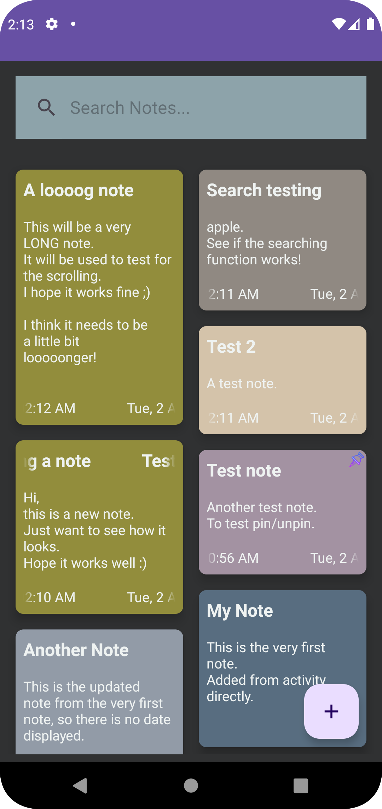
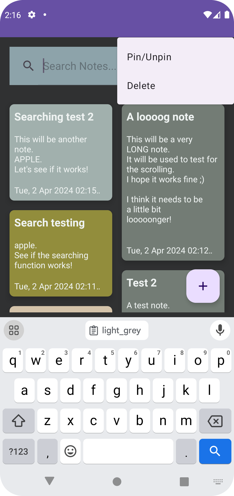
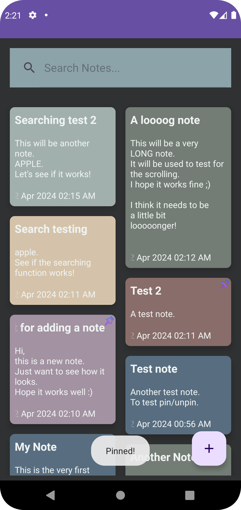
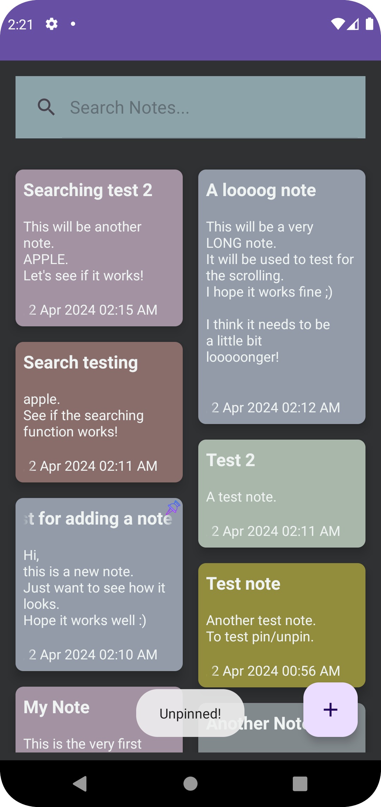
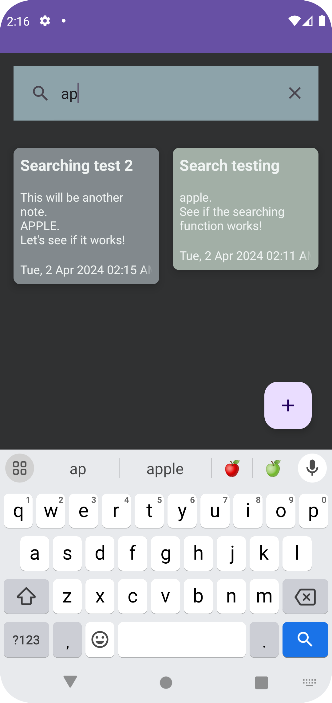
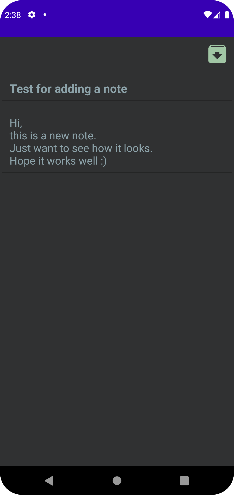

# Note-App
An Android note app. It allows the user to add, read, edit and delete a note. It also supports the searching function, so the user can search for a specific note.

# Screenshots

   &nbsp;&nbsp;  
   

   &nbsp;&nbsp;
  

   &nbsp;&nbsp;
  

